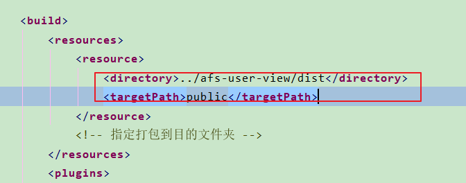

## Springboot+Vue.js搭建前后端分离项目

[https://blog.codecentric.de/en/2018/04/spring-boot-vuejs/](https://blog.codecentric.de/en/2018/04/spring-boot-vuejs/)

前台模块:

1. 安装vue-cli
`npm install --global vue-cli`

2. 进入路 ./frontend 
`vue init webpack frontend`

Tell webpack to output build contents to /target
The standard Node.js way is to create a dist directory for builds which 
contain the minified source code of our web application. But as we use 
Maven here, we need to have everything in the target directory. 
Therefore we need to change the generated frontend/config/index.js and 
replace the following lines:

```
index: path.resolve(__dirname, '../dist/index.html'),
assetsRoot: path.resolve(__dirname, '../dist'),
```
换成-->
```
index: path.resolve(__dirname, '../target/dist/index.html'),
assetsRoot: path.resolve(__dirname, '../target/dist'),
```


```
   <!--打包页面(Test)-->
            <plugin>
                <artifactId>maven-resources-plugin</artifactId>
                <executions>
                    <execution>
                        <id>copy-static-content</id>
                        <phase>generate-resources</phase>
                        <goals>
                            <goal>copy-resources</goal>
                        </goals>
                        <configuration>
                            <outputDirectory>src/main/resources/public</outputDirectory>
                            <overwrite>true</overwrite>
                            <resources>
                                <resource>
                                    <directory>别的目录</directory>
                                    <includes>
                                        <include>static/</include>
                                        <include>index.html</include>
                                    </includes>
                                </resource>
                            </resources>
                        </configuration>
                    </execution>
                </executions>
            </plugin>
```


**我也照着上面的配置貌似不好使, 还不如下面的干净利索:**		<maven 打包别的目录文件到指定目录下>



