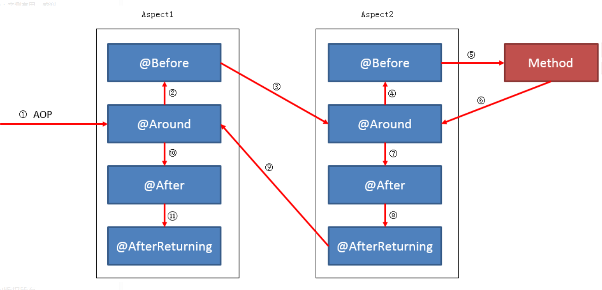
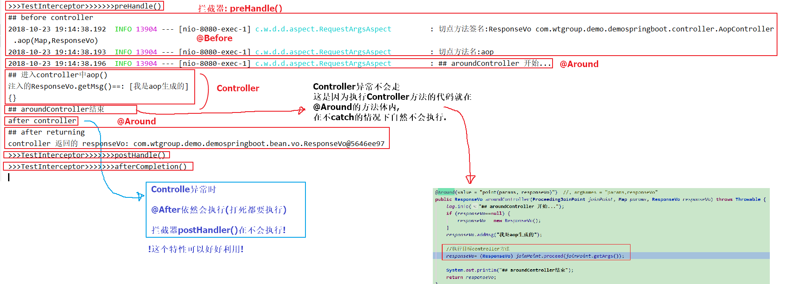
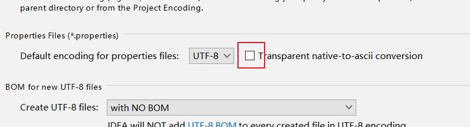

# SpringBoot Demo


## spring boot 静态页面配置

```
spring.resources.static-locations=classpath:static/,file:static/,classpath:public/,file:public/
```
将会自动从配置的所有路径下找. *默认是static/*


## Log

```
#Slf4j
private static final Logger log = LoggerFactory.getLogger(TestController.class);
#Log4j2
private static final Logger log = LogManager.getLogger(RequestArgsAspect.class);
```


## HttpAop

1 引入aop依赖

```xml
<dependency>
    <groupId>org.springframework.boot</groupId>
    <artifactId>spring-boot-starter-aop</artifactId>
</dependency>
```

2 准备测试Controller

3 穿件aop类
3.1 注意类上注解:
`@Aspect`和`@Component`
3.2 设置切点
```
@Pointcut("execution(public * com.wtgroup.demo.demospringboot.controller.AopController.*(..))")
```

4 效果
```
before controller
进入controller中aop()
after controller
after returning
```

## 统一异常处理


包装类的校验异常, 统一异常处理类, 也能够**捕获**.

> * 套路

1. 表单参数包装类接收, 在需要校验的字段上加入相应的校验规则注解.
2. controller方法上加入`@Valid`, 并加上入参:`BindingResult`.
3. 校验有错误, 则抛出异常, 让统一*异常处理类*处理, 返回统一的*响应结果包装类*.


## 枚举类新玩法

> 定义公共方法, 相当于抽象方法. 各个枚举元素实现此方法.

为了逼真, 外层定义的公共方法, 什么都不做, 仅抛出 `java.lang.AbstractMethodError`.
当然, 也可以定义公有的方法体.


## `@RequestParam` and `@RequestBody`

前者适用于获取get url请求参数; 后者适用于请求体参数


## 读取自定义配置

###### 法一: 自定义配置类读取配置(结合@Value)

```
@Value("${test.name}")
private String name;
```

**无需setter方法**


###### 法二: 自定义配置类读取配置(无需@Value)

```
@Component
@ConfigurationProperties(prefix = "jfai.afs")
@PropertySource(value="classpath:application.properties",encoding = "UTF-8",ignoreResourceNotFound=false)
```

类中定义和配置文件中key对应的字段名, 并且**要给定setter方法**. 

```
#配置文件中
jfai.afs.appName=AntiFraudService
jfai.afs.charset=UTF-8
#!自动将_对应到驼峰命名!
jfai.afs.rsa_pubkey=xxx
jfai.afs.rsa_privkey=yyy

#配置类中
private String appName;
private String charset;

private String rsaPubkey;
private String rsaPrivkey;

```


[@ConfigurationProperties](https://blog.csdn.net/qq_30739519/article/details/78791142)


###### 法三: Environment对象

```
@Resource
private Environment environment;


System.out.println(environment.getProperty("test.skill"));
System.out.println(environment.getProperty("test.speak"));
```

## 拦截器

###### 坑:
sb1.x 继承WebMvcConfigurerAdapter, 重写addInterceptors().
sb2.x WebMvcConfigurerAdapter 已经标记过时了, 网上说用WebMvcConfigurationSupport代替, 可是静态资源无法访问, 借鉴网上说的手动addResourceHandlers()后还是不行.
**解决**: 实现`WebMvcConfigurer`(示例: com.wtgroup.demo.demospringboot.config.MyWebConfig)


## Controller Aop和拦截器执行顺序

###### 两个Aspect类

[详细顺序测试  | @Order注解](https://blog.csdn.net/rainbow702/article/details/52185827)




*以下测试是特例, 不能算普遍情况*

一个类中@Around, 一个类中@Before,@After,@AfterReturning.

无异常时: 

*preHandle() >> @Before >> @Around: >> Controller >> @Around// >> @After > postHandle() >> afterCompletion*




## 命令行参数
命令：java -jar xxx.jar --server.port=8888，通过使用–-server.port属性来设置xxx.jar应用的端口为8888。 
在命令行运行时，连续的两个减号–就是对application.properties中的属性值进行赋值的标识。所以，java -jar xxx.jar --server.port=8888命令，等价于我们在application.properties中添加属性server.port=8888
```
java -jar demo-springboot-0.0.1-SNAPSHOT.jar --server.port=8099
```
**命令参数优先级高于application.properties**, 就是说同名配置, application.properties的会被覆盖.

开机启动时, 可以通过实现`ApplicationRunner`或`CommandLineRunner`, 实现run方法, 是传入的参数就可以拿到命令行参数.


## 手动注入bean导入spring容器

[Springboot基础篇Bean之动态注册](https://juejin.im/post/5bcc54a9f265da0aaa054b3a)

##### 无依赖简单bean注册

```java
@Slf4j
@Configuration
public class AutoBeanDefinitionRegistryPostProcessor implements BeanDefinitionRegistryPostProcessor {
    @Override
    public void postProcessBeanDefinitionRegistry(BeanDefinitionRegistry registry) throws BeansException {
        //构造bean定义

        BeanDefinitionBuilder beanDefinitionBuilder = BeanDefinitionBuilder.genericBeanDefinition(ManualBean.class);
        // 可以传入构造参数
        //beanDefinitionBuilder.addConstructorArgValue("自动注入依赖Bean");
        BeanDefinition beanDefinition = beanDefinitionBuilder.getBeanDefinition();
        registry.registerBeanDefinition("manualBean", beanDefinition);
    }
```

##### 有依赖的bean注册

注册方式同上. **手动注册时, 依赖属性会自动注入**.

测试Bean:

```java
public class ManualBean {

    // 手动注册时, 依赖属性会自动注入
    @Autowired
    private AutoBean autoBean;

    public void print() {
        System.out.println("ManualBean::");
        autoBean.print();
    }

}
```


> 或者在, `postProcessBeanFactory`方法中实现注册, 参见demo代码.


> 上文方式, 缺陷是, 他会在普通配置类执行之前执行, 在配置文件读取之前执行. **当需要手动注册的Bean需要用到配置文件内容时, 就需要换种方式了**.

##### 方式二: 借助`ApplicationContext`

```
参见: ~/JavaTemplate/ManualRegistBeanUtil.java
```


## 配置文件位置, 加载顺序

[spring boot 使用application.properties 进行外部配置](https://blog.csdn.net/yingxiake/article/details/51260302)

spring boot允许你自定义一个application.properties文件，然后放在以下的地方，来重写spring boot的环境变量或者定义你自己环境变量

1. 当前目录的 “/config”的子目录下
2. 当前目录下
3. classpath根目录的“/config”包下
4. classpath的根目录下

**如果同时在四个地方都有配置文件，配置文件的优先级是从1到4。**


## 其他


##### 切换`Transparent native-to-ascii convesion`会导致原先中文变成Unicode编码显示




##### Response#encodeURL

在禁用cookie的场景下, 操作session.

````
response.encodeURL("http://localhost:8080/test")
http://localhost:8080/test;jsessionid=CCCBF74DED37381204E86859909F6928
````


更新jessionid后会有响应头:

```
Set-Cookie: JSESSIONID=C0D0D6D78A87655E087C6D3EC5126D10; Path=/; HttpOnly
```

```
http://localhost:8080/test;jsessionid=C0D0D6D78A87655E087C6D3EC5126D10
```

jessionid必须要和 Set-Cookie中的 **一致**, 否则, 会更新jessionid.


总结:

- 每次请求到后台, 会取出url后的jsessionid, 但会判断缓存中是否这个jsessionid, 有则认为, 请求带的jsessionid有效, 归为对应的会话. 若缓存没有, 则认为请求带的jsessionid无效, 于是, 重新生成一个jsessionid.