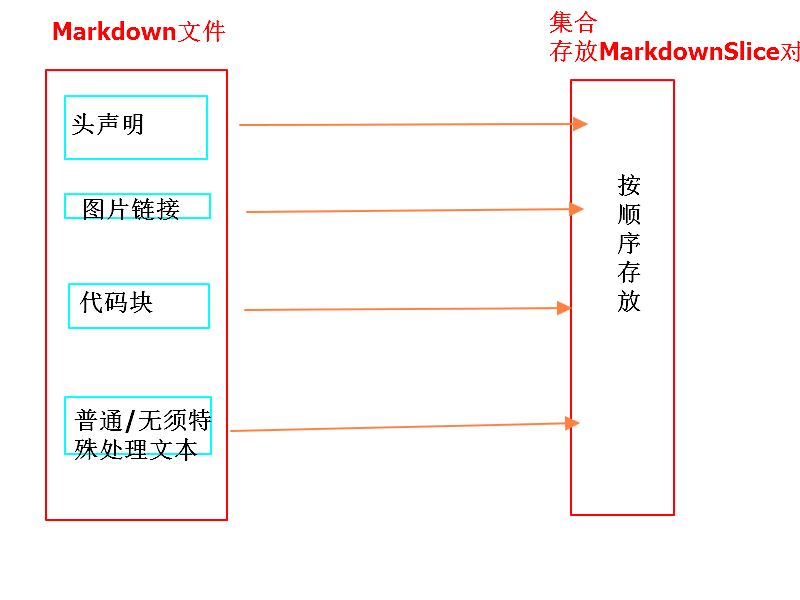
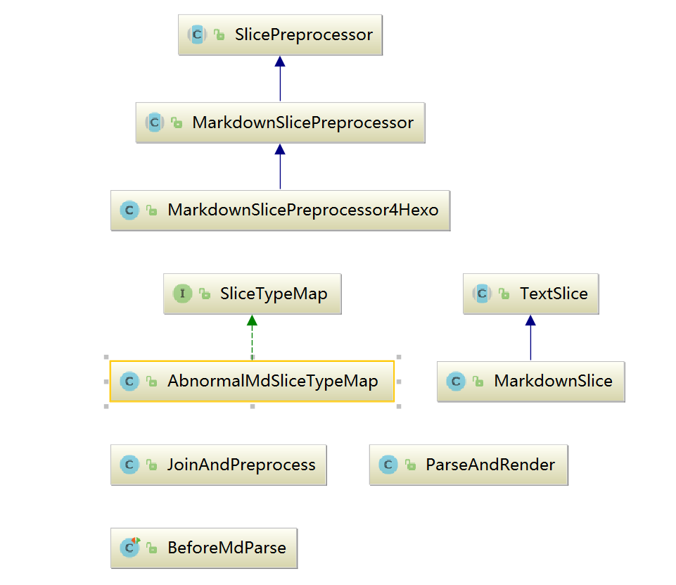
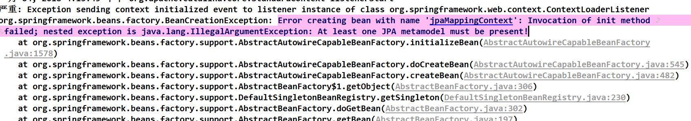
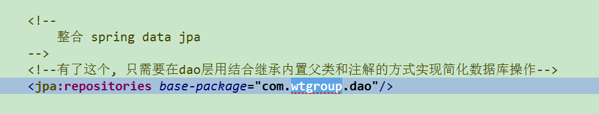
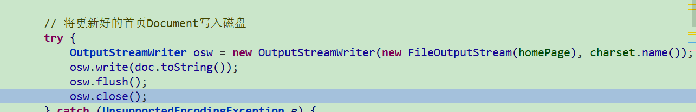

博客系统
========

借鉴hexo框架的前端布局思想, 构建站点文件.

计划
----

>   webapp目录下建立一个`markdown`的文件夹, 只需要在这里面写文档(`md`格式).
>   在文档中通过配置'归档'和'标签'信息.
>   运行相应工具类即可将md文件解析成html文件,
>   并且根据对应的归档的信息放入对应的路径下, 并且更新相应的链接. 这是前期.
>   后期, 可在页面中编写文档.

-   整一个jsp模板 其他信息用el等表达式获取值. 正文部分,
    根据markdown解析的文本替换过来. 其中代码部分要特殊处理(暂不管).

也就是说在动用第三方解析工具前, 我自己要做好预处理. 分解出md文件中头信息,
以及正文中代码块.

html文章在按照时间(年/月/日)建立文件夹归档.

2017年12月18日新写的一个testpost01.md文件, 解析成html, 放入 2017/12/18路径下,
在页面相应位置添加这个路径的链接.

解析md文件至HTML
----------------

### 分解/拆分md文件的思路

**BeforeMdParse**

### 架构

建档
----

根据md文件头声明信息, 在对应的路径下生成html文档. 并且更新链接.

建立大工厂: SiteFactory用来随项目启动而启动.

启动后:

其中: ArticleFactory用来将Markdown文件生成html文章

1.  读取本地md文件们 MarkdownReader

2.  解析成HTML

-   2.1 预处理: 嵌入3方前端框架样式(可选, 如果没有, 则后面解析成默认样式).
    MarkdownPreprocessor 2.2 解析和渲染: MarkdownParserRender 2.3 整合模板,
    指定模板用模板, 没有指定模板(TODO), 默认加载web根目录下的index.\*作为模板,
    但是, 这样只会整合成原始的html文件.

1.  建档 3.1 根据

hexo框架首页结构分析
--------------------

main \|-

~~~~~~~~~~~~~~~~~~~~~~~~~~~~~~~~~~~~~~~~~~~~~~~~~~~~~~~~~~~~~~~~~~~~~~~~~~~~~~~~
|- <article class="post post-type-normal" itemscope itemtype="http://schema.org/Article">
~~~~~~~~~~~~~~~~~~~~~~~~~~~~~~~~~~~~~~~~~~~~~~~~~~~~~~~~~~~~~~~~~~~~~~~~~~~~~~~~

~~~~~~~~~~~~~~~~~~~~~~~~~~~~~~~~~~~~~~~~~~~~~~~~~~~~~~~~~~~~~~~~~~~~~~~~~~~~~~~~

~~~~~~~~~~~~~~~~~~~~~~~~~~~~~~~~~~~~~~~~~~~~~~~~~~~~~~~~~~~~~~~~~~~~~~~~~~~~~~~~

~~~~~~~~~~~~~~~~~~~~~~~~~~~~~~~~~~~~~~~~~~~~~~~~~~~~~~~~~~~~~~~~~~~~~~~~~~~~~~~~

~~~~~~~~~~~~~~~~~~~~~~~~~~~~~~~~~~~~~~~~~~~~~~~~~~~~~~~~~~~~~~~~~~~~~~~~~~~~~~~~

~~~~~~~~~~~~~~~~~~~~~~~~~~~~~~~~~~~~~~~~~~~~~~~~~~~~~~~~~~~~~~~~~~~~~~~~~~~~~~~~

~~~~~~~~~~~~~~~~~~~~~~~~~~~~~~~~~~~~~~~~~~~~~~~~~~~~~~~~~~~~~~~~~~~~~~~~~~~~~~~~

Bugs
====

Error creating bean with name 'jpaMappingContext': Invocation of init method failed; nested exception is java.lang.IllegalArgumentException: At least one JPA metamodel must be present!
----------------------------------------------------------------------------------------------------------------------------------------------------------------------------------------

### 原因

测试中, spring配置文件中有关jpa的配置 **注释掉了**, 但是不小心,
dao层还残留了一项jpa扫描的配置。

### 解决

要么注释掉jpa扫描；要么配置完全jpa。

列表和正文相邻时, 不能很好地分割
--------------------------------

原因: 3方包在解析时根据文章长字符串解析, 碰到md标识会自动处理换行问题.
但是我都当做普通文本处理的. 如果每一行加回车, 非普通文本解析后, 会多一个回车符;
如果都不加, 非普通文本和正文分不开.

3方解析工具, 需要两个回车符才能认为是两个slice(这也符合Markdown的标准规则:
空格一行才能区分不同的段落).

首页整合，html内容后半截没有写进去
----------------------------------

原因：输出流时网络flush和close。

Notice
======

不同slice之间注意要有回车符, 统一在join时添加. 即以回车符连接.
--------------------------------------------------------------

Markdown解析工具, 针对HTML形式的文本会当做HTML, 如果要想原样输出HTML, 则需要将’\<’和’\>’转成, ‘\&lt;’和’ \&gt;’
---------------------------------------------------------------------------------------------------------------

解决: 工具类**HTMLEscaper**

Jsoup选择器选择的对象, 但是html()获取到的是其所有子节点的内容拼接
-----------------------------------------------------------------

关于和前台框架解耦
目前两个环节: 预处理, 模板整合, 归档器耦合, 换个框架需要针对的写实现类.